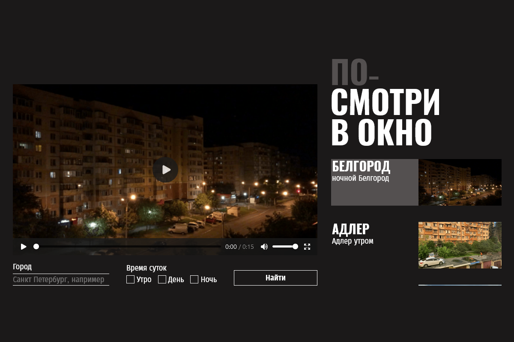

# Проект "Посмотри В Окно" от Яндекс Практикум

## Оглавление

- [Цель проекта](#Цель)
- [Стек](#Стек)
- [Скриншот](#скриншот)
- [Макет](#макет)
- [Ссылки](#ссылки)
- [Автор](#автор)
- [Благодарность](#благодарность)

### Цель проекта

В данной проекте я работал с частично готовым модулем. Стилизовал  уже работающее приложение «Посмотри в окно».

### Стек

- JavaScript
- HTML
- CSS

### Скриншот

### Макет

- Макет задания: [Figma](https://www.figma.com/design/WCjjMyEoG0wVYNkIR06pz9/-4-Посмотри-в-окно--Copy-?node-id=0-1&p=f&t=WK6j35ThX9FYLKzA-0)

### Ссылки

- URL решения: [Github](https://github.com/just01soul/posmotri_v_okno.git)

## Автор

- Github - [Александр Христофоров](https://github.com/just01soul)

## Благодарность

Выражаю благодарность команде Яндекс Практикум за предоставление дизайна и уроков!
